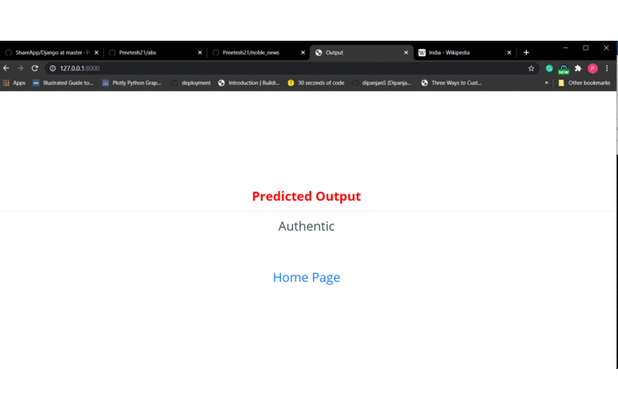

# noble_news

I have built this project using Django,Web Scrapping and Simple Text Analysis to classify as a piece of news article as Fake or True.
Here is a gif showing the functionalities of the website.

There are mainly three things which the websites works on:

1. Links

2. Articles

3. Keywords

For links I have created a databse containing the legitimate sites which are trustworthy such as cnn,wikipedia etc. So whenever someone uses the Links option I extract the domain name and match it in the database and if found in the database then site is authentic else not so sure.

For keywords, I basically use those and request a google search and the top articles that appear are taken into consideration and their domains are run into the database and a score is assigned based on the number of valid sites.

For Articles, I use a machine learning which helps in deciding whether the text is true or false. For training I had used a dataset from kaggle.
